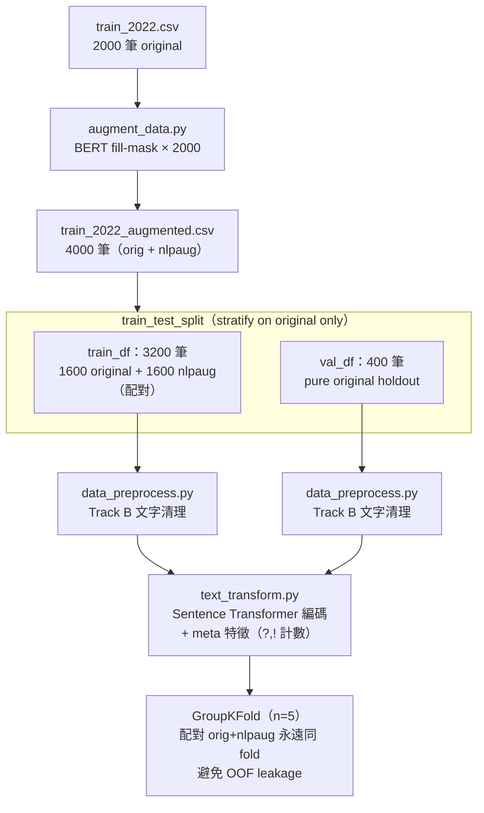
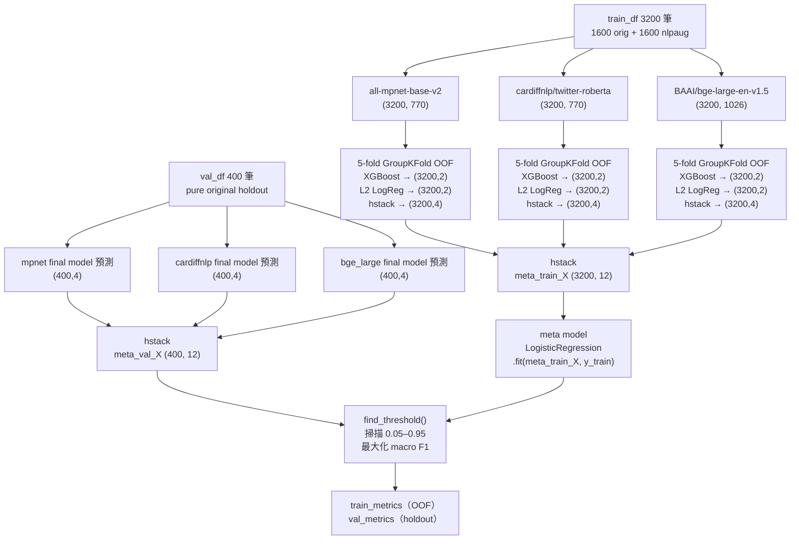
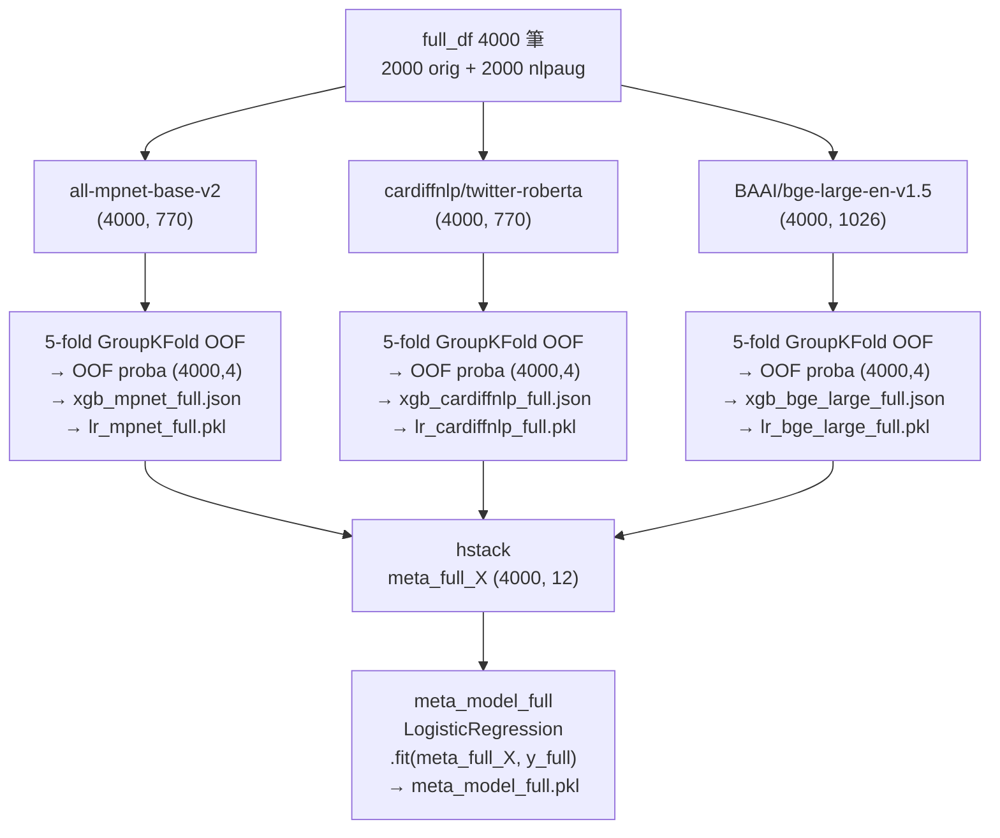
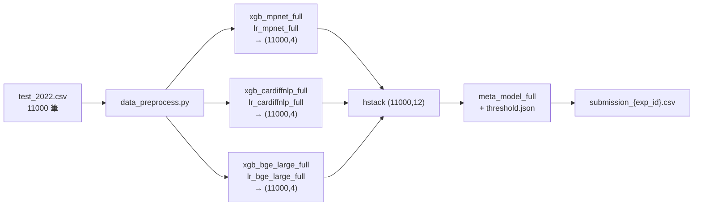

# 文字極性分類

Kaggle 競賽 — 對混合領域評論（電影、商品、遊戲）進行二元情感分類（正面 / 負面）。  
訓練集 2000 筆 / 測試集 11000 筆，評估指標為 macro F1。

---

## 專案結構

```
.
├── config/
│   └── config.yaml              # 中央參數設定（所有實驗皆從此讀取）
├── datasets/
│   ├── train_2022.csv           # 原始訓練資料（2000 筆）
│   ├── train_2022_augmented.csv # NLPaug 擴增後（4000 筆，由 augment_data.py 產生）
│   ├── test_2022.csv            # 測試資料（11000 筆）
│   └── sample_submission.csv
├── src/                         # 核心模組（被訓練/預測腳本呼叫）
│   ├── data_preprocess.py       # 文字清理（Track B：還原括號、縮寫修復、標點）
│   ├── text_transform.py        # Sentence Transformer 編碼 + meta 特徵拼接
│   ├── dimension_decrease.py    # PCA / PLS 降維（可設 none 略過）
│   ├── model_train.py           # XGBoost + L2 LogReg OOF 訓練
│   ├── model_stack.py           # Meta model 建構、threshold 搜尋、預測
│   ├── augment.py               # BERT contextual fill-mask 擴增實作
│   ├── experiment.py            # metrics.json / results.csv 寫入
│   └── utils.py                 # set_seed 等共用工具
├── EDA/                         # 探索性分析與消融實驗（非正式流程）
│   ├── EDA.ipynb
│   ├── Method0_Baseline.ipynb
│   ├── Method1_BertHybrid.ipynb
│   ├── Method2_BertHybrid_Regularized.ipynb
│   ├── ablation_exp016.py       # 模型組合 × 分類器消融（14 條件）
│   ├── ablation_pca.py          # PCA 維度消融（stacking 版）
│   ├── ablation_pca_2model.py   # 2-model × PCA 維度消融
│   ├── ablation_pca_3model.py   # 3-model × PCA 維度消融
│   ├── ablation_augment.py      # 資料擴增策略消融
│   ├── tune_xgb.py              # Optuna XGBoost 超參搜尋
│   ├── train.py                 # 單模型訓練（早期實驗用）
│   └── predict.py               # 單模型預測（早期實驗用）
├── experiments/                 # 實驗記錄（metrics.json、config snapshot）
│   └── results.csv              # 所有實驗彙總指標
├── models/                      # 訓練好的模型（.gitignore）
├── results/                     # Submission 輸出（.gitignore）
├── augment_data.py              # 資料擴增入口（產生 train_2022_augmented.csv）
├── train_stacking.py            # Stacking 訓練主腳本
├── predict_stacking.py          # Stacking 預測／提交腳本
└── requirements.txt
```

---

## 各腳本功能說明

| 腳本 | 功能 |
|------|------|
| `augment_data.py` | 讀取 `train_2022.csv`，用 BERT fill-mask 對每筆產生一筆擴增樣本，輸出 `train_2022_augmented.csv`（4000 筆） |
| `train_stacking.py` | 完整 Stacking 訓練流程：資料分割 → 前處理 → base model OOF → meta model → threshold 搜尋 → 評估 → 全量重訓 → 儲存模型 |
| `predict_stacking.py` | 載入 `_full` 模型對 test set 編碼推論，輸出 `results/submission_{exp_id}.csv` |

### src/ 模組

| 模組 | 功能 |
|------|------|
| `data_preprocess.py` | Track B 文字清理：`-lrb-/-rrb-` 還原括號、num token 替換、縮寫修復、標點空白正規化 |
| `text_transform.py` | 以 SentenceTransformer 將文字編碼為 embedding，並拼接 meta 特徵（`?` / `!` 計數） |
| `dimension_decrease.py` | PCA / PLS 降維，支援 `fit_transform` 和 `transform`；`method: none` 略過 |
| `model_train.py` | `get_oof_multi()`：5-fold GroupKFold / StratifiedKFold 同時跑 XGBoost + L2 LogReg，回傳 OOF 機率與 final model |
| `model_stack.py` | `build_meta()`：建構 meta LogReg；`find_threshold()`：掃描 0.05–0.95 最大化 macro F1；`predict_with_threshold()` |
| `augment.py` | `contextual_augment()`：BERT fill-mask pipeline，aug_p=0.1，每筆最多替換 10% tokens |
| `experiment.py` | `save_metrics()` 寫 metrics.json；`log_to_csv()` 追加 results.csv；`snapshot_config()` 複製 config |
| `utils.py` | `set_seed(cfg)`：固定 numpy / random / torch 隨機種子 |

---

## 環境安裝

```bash
conda create -n textpolarity python=3.11 -y
conda activate textpolarity
pip install -r requirements.txt
```

---

## 提交流程

```bash
# 1. 產生擴增資料（只需執行一次）
python augment_data.py

# 2. 設定實驗 ID
# 編輯 config/config.yaml → experiment.id

# 3. 訓練
python train_stacking.py

# 4. 預測
python predict_stacking.py

# 5. 上傳 results/submission_{exp_id}.csv 至 Kaggle
```

---

## 資料處理流程



---

## Stacking 架構

### 評估階段（3200 train + 400 holdout）



### 全量重訓階段（提交用，4000 筆）



### 推論階段（predict_stacking.py）



---

## 實驗紀錄

| 實驗 ID | 描述 | Train F1 | Val F1 | Public | Private |
|---------|------|----------|--------|--------|---------|
| exp_003 | MiniLM + XGBoost（正則化） | 0.9937 | 0.7124 | — | — |
| exp_004 | + CountVectorizer LDA | 0.9900 | 0.7171 | — | — |
| exp_005 | 消融：移除 LDA | 0.9912 | 0.7374 | 0.71587 | 0.71404 |
| exp_006 | + NLI 領域特徵 | 0.9925 | 0.7250 | — | — |
| exp_007 | 換 mpnet（768-dim） | 0.9988 | 0.8200 | — | — |
| exp_008 | cardiffnlp 情感模型 | 0.9969 | 0.7875 | — | — |
| **exp_009** | **Stacking（mpnet + cardiffnlp）** | **0.8344** | **0.8375** | **0.77761** | **0.76749** |
| exp_010 | cardiffnlp + VADER（對照組） | 0.9969 | 0.7849 | — | — |
| exp_011 | mpnet + VADER | 0.9969 | 0.8024 | — | — |
| exp_012 | Stacking + num token 正規化 | 0.8337 | 0.8350 | — | — |
| exp_013 | Stacking baseline（模組化重構後基準） | 0.8294 | 0.8375 | — | — |
| exp_014 | Stacking + PCA 32-dim 降維 | 0.8212 | 0.8400 | — | — |
| exp_015 | Stacking + PCA 32-dim + Optuna XGBoost | 0.8325 | 0.8400 | — | — |
| **exp_016** | **3 models + XGBoost + L2 LogReg（消融驗證）** | **0.8569** | **0.8625** | — | — |
| exp_017 | 3 models + XGB+LR + no DR | 0.8569 | 0.8800 | 0.79256 | 0.80149 |
| exp_018 | 3 models + XGB+LR + no DR + threshold tuning | 0.8562 | 0.8850 | 0.79476 | 0.79782 |
| exp_019 | 3 models + NLPaug（data leakage，分數不可信） | 0.9200 | ~~0.9387~~ | — | — |
| exp_020 | 3 models + NLPaug + leakage 修正 | 0.9428 | 0.8675 | — | — |
| exp_021 | 3 models + NLPaug + GroupKFold（leakage 完整修正） | 0.8497 | 0.8825 | — | — |
| exp_022 | 3 models + NLPaug + aug only in train fold | 0.8549 | — | — | — |
| exp_023 | 3 models + NLPaug + 2-level OOF | 0.8589 | 0.8594 | — | — |
| **exp_024** | **3 models + NLPaug + GroupKFold + holdout val** | **0.8491** | **0.8875** | **0.79118** | **0.80488** |
| exp_025 | 3 models + no aug + holdout val（對照組） | 0.8562 | 0.8850 | 0.79476 | 0.79782 |

> exp_003–exp_008：單模型直接 fit，Train F1 ≈ 0.99，嚴重 overfit，Train/Val 差距 > 0.25。  
> exp_009 起改用 OOF Stacking，Train F1 降至 ~0.83，Train/Val 差距收斂到 0.01 以內。  
> exp_010 / exp_011：VADER 無額外貢獻，mpnet embedding 已涵蓋情感信號。  
> exp_014 / exp_015：PCA 32-dim 略升，Optuna 超參與持平，確認超參已近上限。  
> exp_016：消融驗證 — bge_large 是最大貢獻來源（+0.0325），L2 LogReg 配合 bge_large 合用效果最佳。  
> exp_017：移除 PCA，Val F1 回升至 0.8800（PCA 壓縮破壞三模型互補性）。  
> exp_018：threshold tuning（掃描 0.05–0.95），最佳 threshold = 0.59，Val F1 再進 +0.005。  
> exp_019：NLPaug（bert-base-uncased，aug_p=0.1）擴增至 4000 筆，但 original/nlpaug 配對跨 split 造成 data leakage，Val F1 虛高至 0.9387。  
> exp_020：修正 leakage（val 僅用 400 original），Val F1 降至真實 0.8675，低於無增強 exp_018。  
> exp_021：GroupKFold 確保 OOF fold 內配對不跨 fold，Val F1 回升至 0.8825。  
> exp_023：2-level OOF（base+meta 同 fold），Train/Val 差距極小（0.8589 / 0.8594），但因 meta 評估也用 OOF 而非獨立 holdout，可比性較低。  
> **exp_024：GroupKFold OOF（3200 train）+ 400 holdout val，private 0.80488 為目前最高分。**  
> exp_025：回歸無增強原始資料，Kaggle private 0.79782，與 exp_018 相同，確認 NLPaug 對 private score 有正向貢獻（exp_024 > exp_025）。

---

## 消融實驗結果

### 模型組合 × 分類器（EDA/ablation_exp016.py）

固定 PCA 32-dim，14 個條件。

| 模型組合 | 分類器 | meta 維度 | Train F1 | Val F1 |
|----------|--------|-----------|----------|--------|
| mpnet | XGB | (n,2) | 0.8050 | 0.8223 |
| mpnet | XGB+LR | (n,4) | 0.8156 | 0.8200 |
| cardiffnlp | XGB | (n,2) | 0.7931 | 0.7800 |
| cardiffnlp | XGB+LR | (n,4) | 0.7956 | 0.7924 |
| bge_large | XGB | (n,2) | 0.8394 | 0.8600 |
| bge_large | XGB+LR | (n,4) | 0.8431 | 0.8700 |
| mpnet + cardiffnlp | XGB | (n,4) | 0.8325 | 0.8400 |
| mpnet + cardiffnlp | XGB+LR | (n,8) | 0.8319 | 0.8275 |
| **mpnet + bge_large** | **XGB+LR** | **(n,8)** | **0.8506** | **0.8800** |
| mpnet + bge_large | XGB | (n,4) | 0.8500 | 0.8775 |
| cardiffnlp + bge_large | XGB | (n,4) | 0.8444 | 0.8599 |
| cardiffnlp + bge_large | XGB+LR | (n,8) | 0.8456 | 0.8675 |
| mpnet + cardiffnlp + bge_large | XGB | (n,6) | 0.8550 | 0.8725 |
| mpnet + cardiffnlp + bge_large | XGB+LR | (n,12) | 0.8569 | 0.8625 |

> bge_large 是最強單一模型（0.8600），大幅領先 mpnet（0.8223）和 cardiffnlp（0.7800）。  
> cardiffnlp 在 Twitter 情感資料訓練，遇到電影/商品/遊戲評論出現領域偏移，embedding 帶入雜訊。  
> 最佳 2-model 組合（mpnet + bge_large，0.8800）接近 3-model（0.8625），3-model 加入 cardiffnlp 反而略降。

### PCA 維度消融（EDA/ablation_pca_2model.py / ablation_pca_3model.py）

**2-model（mpnet + bge_large）+ XGB+LR**

| 降維設定 | var% | Train F1 | Val F1 |
|----------|------|----------|--------|
| no DR | 100% | 0.8537 | 0.8750 |
| PCA 128-dim | 78.6% | 0.8494 | 0.8775 |
| PCA 64-dim | 62.9% | 0.8512 | 0.8725 |
| **PCA 32-dim** | **48.2%** | **0.8475** | **0.8875** |
| PCA 16-dim | 35.9% | 0.8525 | 0.8750 |

**3-model（mpnet + cardiffnlp + bge_large）+ XGB+LR**

| 降維設定 | var% | Train F1 | Val F1 |
|----------|------|----------|--------|
| **no DR** | **100%** | **0.8569** | **0.8800** |
| PCA 128-dim | 83.6% | 0.8512 | 0.8775 |
| PCA 64-dim | 70.8% | 0.8531 | 0.8775 |
| PCA 32-dim | 58.2% | 0.8525 | 0.8675 |
| PCA 16-dim | 47.4% | 0.8506 | 0.8725 |

> 2-model：PCA 32 是甜蜜點（+0.0125 vs no DR），正則化效果大於資訊損失。  
> 3-model：PCA 反而有損，no DR 最佳；三模型互補 embedding 混合壓縮後多樣性下降。

完整紀錄見 [experiments/results.csv](experiments/results.csv)。
